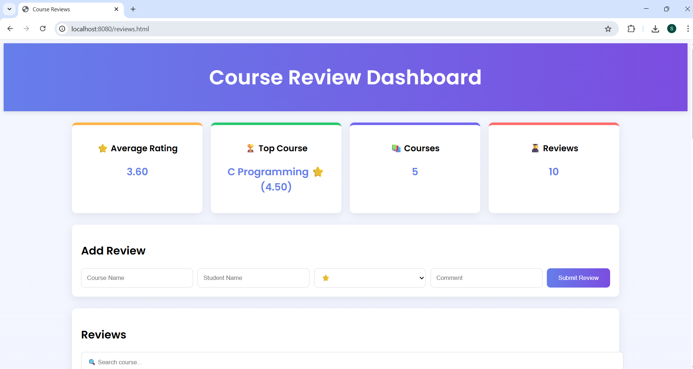
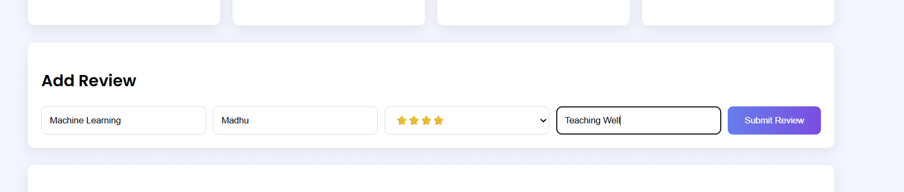
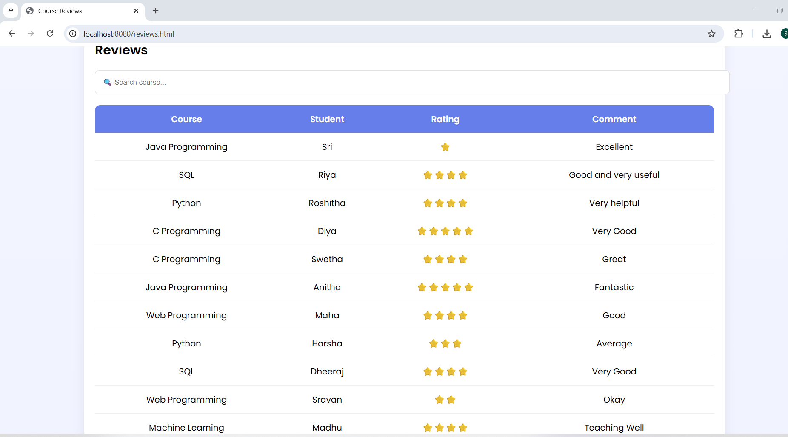
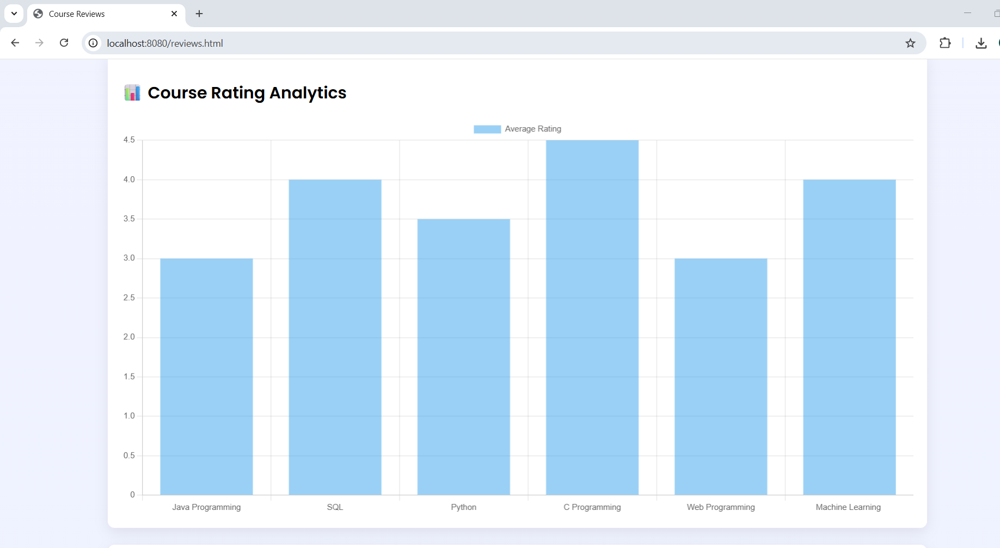
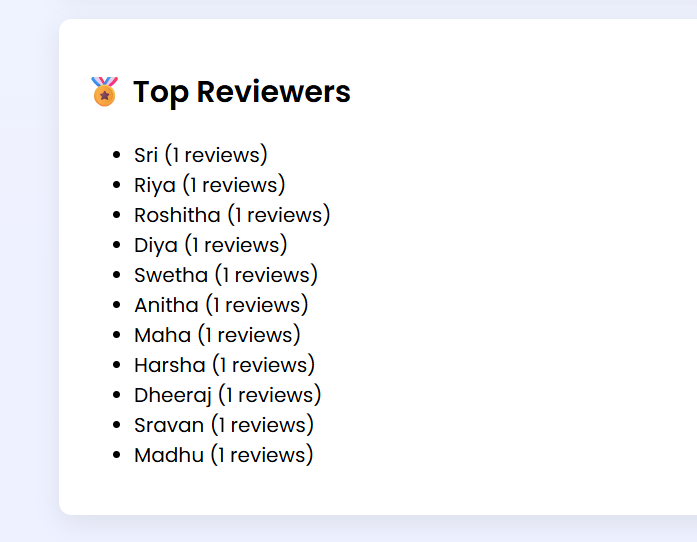

# 📊 Course Review Analyzer

## 🚀 Project Overview

The **Course Review Analyzer** is a web-based application that allows users to submit and analyze course reviews. It provides insights such as average ratings, top courses, and visual analytics using charts.

This project helps students make informed decisions and demonstrates full-stack development using Java and web technologies.

---

## 🛠️ Tech Stack

* **Backend:** Java (Spring Boot)
* **Database:** MySQL
* **Connectivity:** JDBC
* **Frontend:** HTML, CSS, JavaScript
* **Visualization:** Chart.js

---

## ✨ Features

* Add course reviews
* Prevent duplicate entries
* View all reviews in a table
* Calculate average rating
* Identify top-rated course
* Search functionality
* Data visualization (charts)

---

## 🏗️ System Architecture

The system follows a **layered architecture**:

* **Client Layer:** Web Browser (User Interface)
* **Presentation Layer:** HTML, CSS, JavaScript
* **Application Layer:** Spring Boot Controller
* **Data Access Layer:** JDBC
* **Database Layer:** MySQL

---

## 🔗 API Endpoints

### 📥 GET /reviews

Returns all reviews in JSON format

### 📤 POST /addReview

Adds a new review and redirects to dashboard

---

## 📂 Project Structure

```
coursereview/
├── src/
├── screenshots/
├── documentation/
├── demo/
├── README.md
└── pom.xml
```

---

## ▶️ How to Run

1. Clone the repository:

```
git clone https://github.com/srisaisatya2410/course-review-analyzer.git
```

2. Open project in VS Code / Eclipse

3. Configure MySQL database

4. Run Spring Boot application

5. Open in browser:

```
http://localhost:8080
```

---

## 📸 Screenshots









---

## 🎥 Demo Video

👉 [Watch Project Demo]("demo\execution video.mp4")

---

## 📊 Output

* Reviews stored in MySQL database
* Data displayed in table format
* Analytics shown using charts

---

## ✅ Advantages

* Simple and user-friendly
* Real-time data processing
* Prevents duplicate entries
* Helps in decision making

---

## 📌 Conclusion

The Course Review Analyzer successfully demonstrates a full-stack web application that collects, processes, and visualizes course review data effectively.

---

